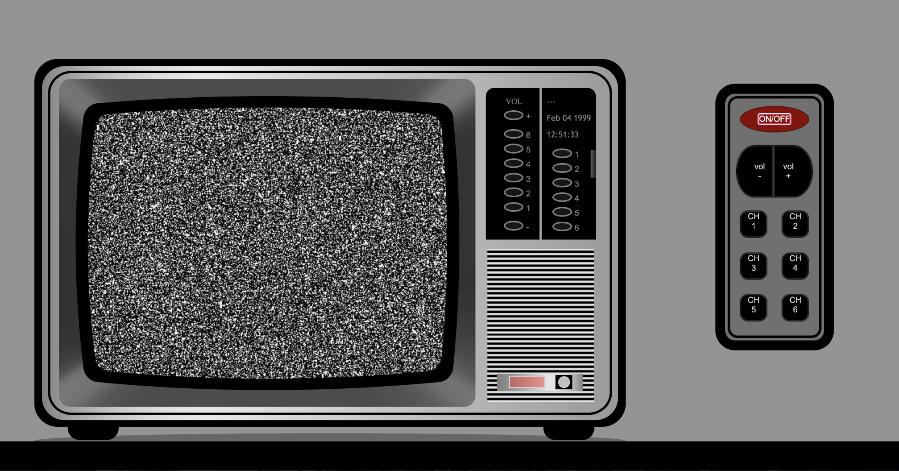

# RETRO TV

2️⃣ This is the SECOND PROJECT of the Full Stack Development Bootcamp with Geekshubs Academy. Based only on HTML, CSS and JAVASCRIPT.

### Table of Contents 🗂️

- [Stack 🛠️](#💻-stack)
- [Introduction ℹ️](#🫵-challenge-introduction) 
- [Coding process ➡️](#➡️-coding-process)
- [Features 🌟](#🌟-features)
- [Live Deployment 📡](#👀-preview)
- [Author ✏️](#✏️-author)

##### 💻 Stack:
    

### 🫵 Challenge introduction

- In this project, the development of a television interface is proposed
(including the interaction with a remote control) using web technologies such as HTML, CSS and JavaScript. The main goal is to create an intuitive and
functional user experience that simulates interaction with a real television. 💡 

- Should display selected channels, hour and date ✅

- Should dynamically change channel info and image ✅

- Remote should control channels, volume, turn tv on/off ✅

- Control validation of functions (when tv is off, other buttons/functions should be blocked) ✅

- Technical stack: 
    - HTML5 
    - CSS3
    - JAVASCRIPT

- Web deployment with Github Pages 🛜
  
- Mandatory README file ⚠️

###  ➡️  Coding process:
- ##### Coding time: 25 - 30 hours ⏳
  
- ##### Project explanation: 💬

The idea of this project is to recreate an old TV with limited options (on/off, volume and channel buttons only) both on the TV itself and on the remote.

1.  <u>**HTML**</u>:
    The page is divided in 2 parts (tv on the left and remote on the right)
    -   **TV:**
        - A .png frame with the shape of an old tv
        - A background `
` that would be toggling to show a blackscreen (when off), static (when on) and 6 different images (one for each channels)
        - Visual onscreen channel indicator (disappearing after 3 seconds)
        - Panel information on the side:
            - Showing current time and date (harcoded year back to 1999)
            - Display of the selected channel
        - Volume control panel:
            - Volume level indicator
            - Plus / minus buttons
        - Visual on/off indicator (green/red light)
        - On/off button
    - **REMOTE:**
        - On/off button
        - Volume control (plus / minus buttons)
        - 6 channel buttons
    Most divs are located using flexbox.
    Some have `position: absolute` to more precisely locate them ontop of the .png frame.
    
2.  <u>**CSS**</u>:
    - The TV shape is the only element I´ve downloaded from the internet and added as a .png image ``.
    - The side panel is mapped with divs to create the needed buttons and info display
    - `:hover` effect on the buttons make it look like little lights
    - The remote design relates to the TV shape.
    - Buttons on the remote seem to be clicked:
        - different color double border give a 3D look
        - opacity change only when clicked (`:active`) reinforce the idea

3.  <u>**JavaScript**</u>:
    - A div centered behind the .png frame would be switching classes to display different images.
    - Main variables:

        - `let image`:
        _blackscreen when off
        _static when on
        _image when a channel is selected
        - `let redBtn` (on/off button on the remote)
        - `let signal` (on/off button on the tv)
        
    - HTMLcollections:
        - `allBtns` (6 channel buttons on remote)
        - `tvBtns` (6 channel buttons on the tv)
        - `tvVolBtns` (6 'light indicators' show volume level)
        `Array.from()` converts collections into arrays that can be mapped `arr.map()`

    - Display panel:
        - `Date()` function loads current time (`displayTime`) and date (`displayDay`).
        - `displayChannel` displays the selected channel (or a defaulted "---" if none is selected)

    - Functions:
        - `const onOff` toggles between blackscreen (off) and static (on)
            - it removes `blackScreen` added to the `let image` (main image display)
            - it adds a new class `static` (when ON)
            - controls the tip-off light (switching red/green colors)
            - displays panel of information only when ON
            - allows volume control only when ON

        
        - Channel control:
            - Mapping an array of channels, `addEventListener` removes last class and adds a new one (with its picture) for each button.
            - Display info panel updates the channel name
            - Onscreen display of channel name (only for 3 seconds using a `setTimeout()` function)

        - `const VolumeUp` and `const VolumeDown` use a `let count` variable outside the function, adding "+1" with every click of the button, so the next div gets the "light on" class.

### 🚀 Have a look at the deployed version here: 
https://sergiotorresgarcia.github.io/Proyecto2-TV/

### 🌟 Features 

- On / Off function (blocking all other functionalities)
- Second ON / Off button on the tv
- Visual tip-off light (for on and off status)
- 6 channel views
- Channel control (from remote and on tv) - separate buttons
- Volume control (from remote and on tv) - +/- buttons

- Current time - visible when tv is on
- Current date (only day and month, year is hardcoded, back to 1999) - visible when tv is on
- Current channel information - visible only after selecting a channel (default is "---")
    - Fixed on side panel
    - Temporary onscreen (only for 3 sec.)
- Use of CSS transitions:
    - Remote buttons seem to be "clicked"
    - TV buttons light up when clicked
    - Volume level indicator - green light

### 👀 Preview:

### ✏️ Author:
**Sergio Torres García**
Project Developer ([GitHub](https://github.com/SergioTorresGarcia))
